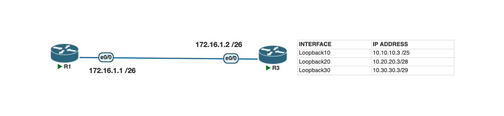

# Lab 1. Configure, Verify, and Troubleshoot IPv4 Addresses

## Lab Objective
Learn how to configure and troubleshoot IPv4 addressing on Cisco routers.

## Lab Purpose
IPv4 addressing is one of the most fundamental skills for a Cisco engineer. The CCNA exam may also test the ability to troubleshoot an incorrectly configured IPv4 address, so knowing the right `show` commands to diagnose issues is essential.

## Lab Topology

| Interface   | IP Address     |
|-------------|----------------|
| Loopback10  | 10.10.10.3/25  |
| Loopback20  | 10.20.20.3/28  |
| Loopback30  | 10.30.30.3/29  |

- R1 e0/0: `172.16.1.1/26`
- R3 e0/0: `172.16.1.2/26`

## Tasks

### Task 1
Configure the hostnames on R1 and R3 as shown in the topology.

### Task 2
Configure the IP addresses on the e0/0 interfaces of R1 and R3 as shown in the topology. Configure the loopback interfaces on R3 as specified in the table above.

### Task 3
Use the appropriate `show` commands to verify:
1. A summary of all configured IP addresses
2. Interface status (up/down or administratively down)
3. The subnet mask applied to each interface

## Verification Commands
- `show ip interface brief`
- `show running-config`
- `show interfaces`

## Files
- [Topology screenshot](topology.png)
- [PNETLab file](lab.unl)
- [Configs](configs/)
  - [R1](configs/R1.txt)
  - [R3](configs/R3.txt)

## Status
🔲 In Progress

