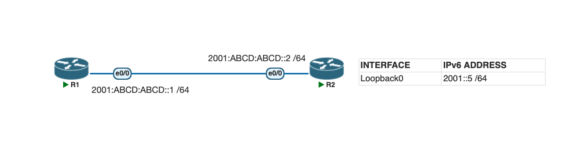

# Lab 2. Configure, Verify, and Troubleshoot IPv6 Addresses

## Lab Objective
Learn how to configure and troubleshoot IPv6 addressing on Cisco routers.

## Lab Purpose
IPv6 addressing is increasingly important as networks transition away from IPv4. The CCNA exam tests the ability to configure IPv6 unicast addresses on interfaces and troubleshoot incorrectly configured addresses, so knowing the right `show` commands to diagnose issues is essential.

## Lab Topology

| Interface | IPv6 Address    |
|-----------|------------------|
| Loopback0 | 2001::5/64       |

- R1 e0/0: `2001:ABCD:ABCD::1/64`
- R2 e0/0: `2001:ABCD:ABCD::2/64`

## Tasks

### Task 1
Configure the hostnames on R1 and R2 as shown in the topology.

### Task 2
Enable IPv6 unicast routing and configure the IPv6 addresses on the e0/0 interfaces of R1 and R2 as shown in the topology. Configure the loopback interface as specified in the table above.

### Task 3
Use the appropriate `show` commands to verify:
1. A summary of all configured IPv6 addresses
2. Interface status (up/down or administratively down)
3. The IPv6 address and prefix length applied to each interface

## Verification Commands
- `show ipv6 interface brief`
- `show ipv6 interface e0/0`
- `show running-config`

## Files
- [Topology screenshot](Topology.png)
- [PNETLab file](lab2-ipv6-addresses-pnetlab.zip)
- [Configs](configs/)
  - [R1](configs/R1.cfg)
  - [R2](configs/R2.cfg)

## Status
✅ Done
