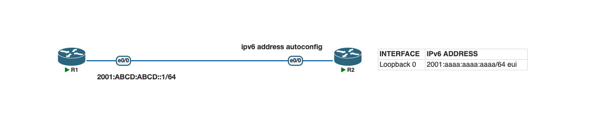

# Lab 3. IPv6 Address Autoconfiguration

## Lab Objective
The objective of this lab exercise is for you to learn and understand how to configure IPv6 addresses on Cisco routers using address autoconfiguration and EUI-64 addressing.

## Lab Purpose
Configuring IPv6 addressing is one of your most fundamental tasks as a Cisco engineer. In the exam, you may also be asked to configure an IPv6 address using Stateless Address Autoconfiguration (SLAAC) as well as EUI-64 addressing.

## Lab Topology

| Interface        | IPv6 Address                    |
|-------------------|----------------------------------|
| R2 Loopback0      | `2001:AAAA:AAAA:AAAA::/64` (EUI-64) |

- R1 e0/0: `2001:ABCD:ABCD::1/64`
- R2 e0/0: `ipv6 address autoconfig` (SLAAC — learns the prefix from R1's Router Advertisement)

## Tasks

### Task 1
Configure the hostnames on routers R1 and R2 as illustrated in the topology.

### Task 2
Configure the IPv6 addresses on the Ethernet interfaces of R1 and R2 as illustrated in the topology.

- R1 e0/0 is configured with a static IPv6 address and advertises the prefix.
- R2 e0/0 uses SLAAC (`ipv6 address autoconfig`) to obtain the address prefix from R1.
- R2 Loopback0 uses EUI-64 to complete the host portion of the address from the configured prefix.

### Task 3
Use the correct `show` commands to check:
1. A summary of all configured IP addresses
2. The status of the interface (up/down or administratively down)
3. The subnet mask applied to the interface

## Verification Commands
- `show ipv6 interface brief`
- `show ipv6 interface e0/0`
- `show ipv6 interface loopback 0`
- `show running-config`

## Files
- [Topology screenshot](topology.png)
- [PNETLab file](lab3-ipv6-autoconfig-pnetlab.zip)
- [Configs](configs/)
  - [R1](configs/R1.cfg)
  - [R2](configs/R2.cfg)

## Status
✅ Done
