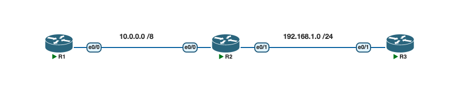

# Lab 4. ARP and Proxy ARP

## Lab Objective
The objective of this lab exercise is to learn and understand how ARP and Proxy ARP are used by a router to encapsulate a packet before it is sent to a neighboring device.

## Lab Purpose
Understanding how ARP works is essential for passing the CCNA exam. You could well be faced with an ARP-related issue to troubleshoot, both in the exam and in the real world.

## Lab Topology

| Link              | Network            |
|-------------------|---------------------|
| R1 e0/0 – R2 e0/0  | `10.0.0.0/8`         |
| R2 e0/1 – R3 e0/1  | `192.168.1.0/24`     |

- R1 e0/0: `10.0.0.1/8`
- R2 e0/0: `10.0.0.2/8`
- R2 e0/1: `192.168.1.1/24`
- R3 e0/1: `192.168.1.2/24`

## Tasks

### Task 1
Configure the hostnames on routers R1, R2, and R3 as illustrated in the topology.

### Task 2
Configure the IP addresses on the Ethernet interfaces of R1, R2, and R3 as illustrated in the topology.

Add static routes so that R1 can ping the host address on R3, and R3 can return the ping. A default route pointing out the local Ethernet interface (with no next-hop IP specified) is used on R1 and R3 — this is what forces each router to rely on ARP/Proxy ARP to reach the remote subnet. R2 needs no static route, since it is directly connected to both networks. Once routing is in place, check the ARP cache on R1.

### Task 3
Use the correct `show` commands to check:

1. **The ARP cache on R1. What are the times for the learned addresses? Which entry will not time out, and how can you tell?**
2. **What is the entry for R3, and why is it the same as the R2 Ethernet interface?**
3. **What does the `-` in the ARP table mean?**

## Answers / Explanation

1. **ARP cache timers** — Run `show arp` (or `show ip arp`) on R1. Dynamically learned entries display an age in `hh:mm:ss` format that counts up toward the ARP timeout, which defaults to **4 hours (14400 seconds)** on Cisco IOS. Once an entry reaches that age it is flushed and must be re-learned with a fresh ARP request. This timeout is configurable per interface with `arp timeout <seconds>` in interface config mode. The entry that will **not** time out is R1's own interface address (`10.0.0.1`) — you can tell because its **Age** column shows a dash (`-`) instead of a counting timer, since it is a locally owned address, not something learned dynamically via ARP.

2. **The entry for R3 (`192.168.1.2`)** — This entry appears in R1's ARP table because R1's default route points out its own e0/0 interface with no next-hop IP. Since R1 has no route information beyond "send it out e0/0," it ARPs directly for the destination IP address, `192.168.1.2`. R1 has no way of resolving that address itself — R2 answers on R3's behalf using **Proxy ARP**, which is enabled by default on Cisco IOS interfaces (`ip proxy-arp`). R2 knows the real route to `192.168.1.0/24` (out e0/1), so it replies to R1's ARP request with its **own e0/0 MAC address**, pretending to be `192.168.1.2`. As a result, R1's ARP table maps `192.168.1.2` to R2's e0/0 MAC address — the same MAC used for R2's own IP (`10.0.0.2`).

3. **The `-` in the ARP table** — A dash in the Age column means the entry is **permanent/static** from the router's own perspective and will never expire or be aged out. It marks an address that belongs to the router itself (its own interface IP/MAC pair), so there is no need to relearn it via ARP.

## Verification Commands
- `show arp` / `show ip arp`
- `show ip route`
- `show ip interface brief`
- `debug arp` — useful for watching ARP requests/replies in real time, including Proxy ARP replies from R2, while pinging between R1 and R3
- `show running-config`

## Files
- [Topology screenshot](topology.png)
- [PNETLab file](lab4-arp-proxyarp-pnetlab.zip)
- [Configs](configs/)
  - [R1](configs/R1.cfg)
  - [R2](configs/R2.cfg)
  - [R3](configs/R3.cfg)

## Status
✅ Done
